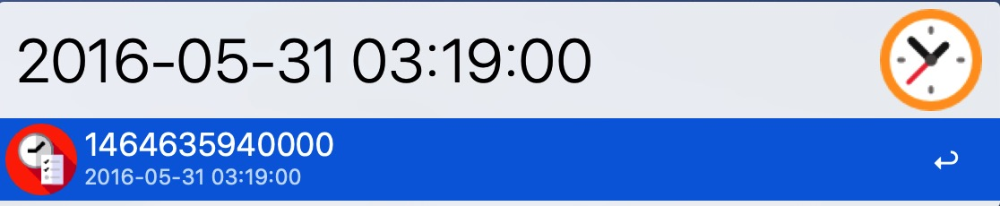
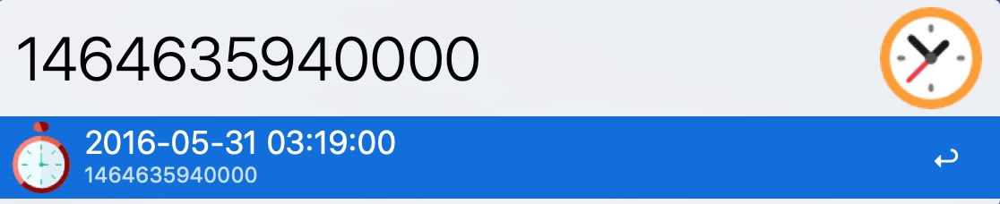

# alfred-timestamp

> [Alfred 3](https://www.alfredapp.com/) workflow，时间戳与格式化日期相互转换 Convert between Timestamp and Formatted Date

  
  

## Install

```js
$ npm install --global alfred-timestamp
```

Requires [Node.js](https://nodejs.org/) 4+ and the Alfred [Powerpack](https://www.alfredapp.com/powerpack/).

## Usage

In Alfred, type `time`, <kbd>Enter</kbd> or <kbd>Space</kbd>, and the timestamp or formatted date.

alfred-timestamp will automatically convert the timestamp (formatted date) to formatted date (timestamp)

Press <kbd>Enter</kbd>, Copy result to Clipboard.  
Hold <kbd>Command</kbd> and Press <kbd>Enter</kbd>, Show on Large Type and Copy to Clipboard.

## Related

- [alfy](https://github.com/sindresorhus/alfy) - Create Alfred workflows with ease
- [moment](http://momentjs.com/) - Parse, validate, manipulate, and display dates and times in JavaScript.

## License

[Apache 2.0](LICENSE) © [ManerFan](https://github.com/manerfan)